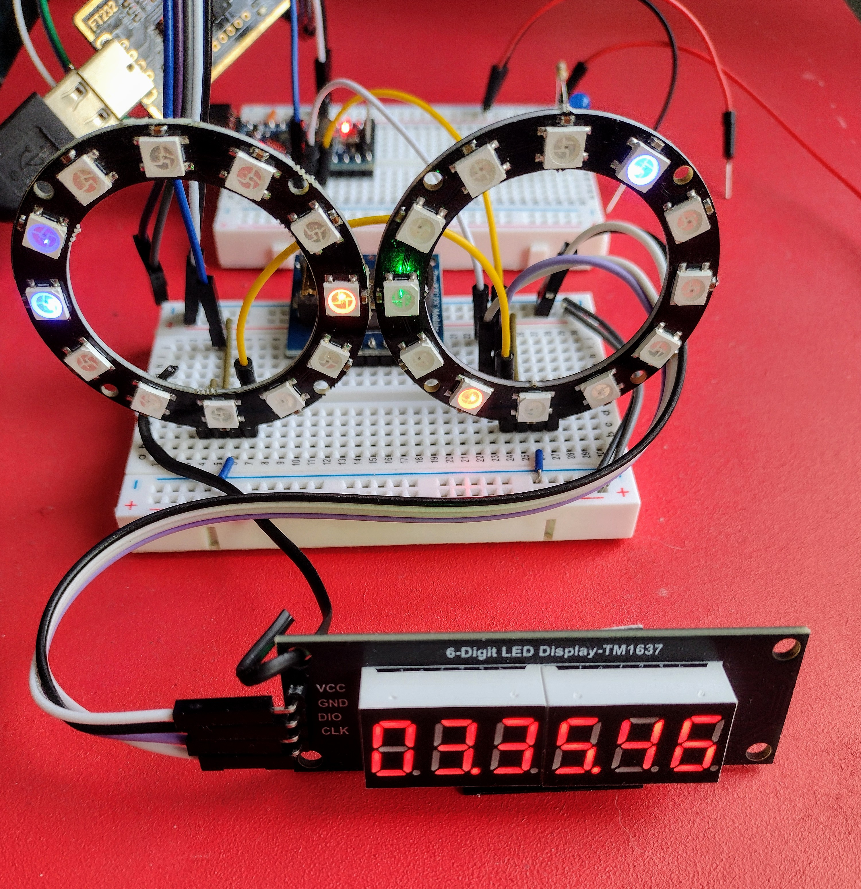
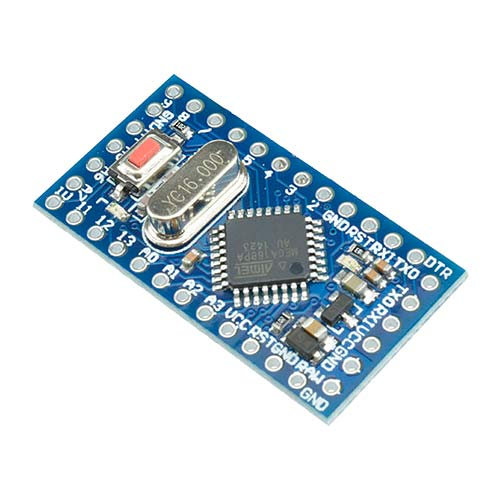
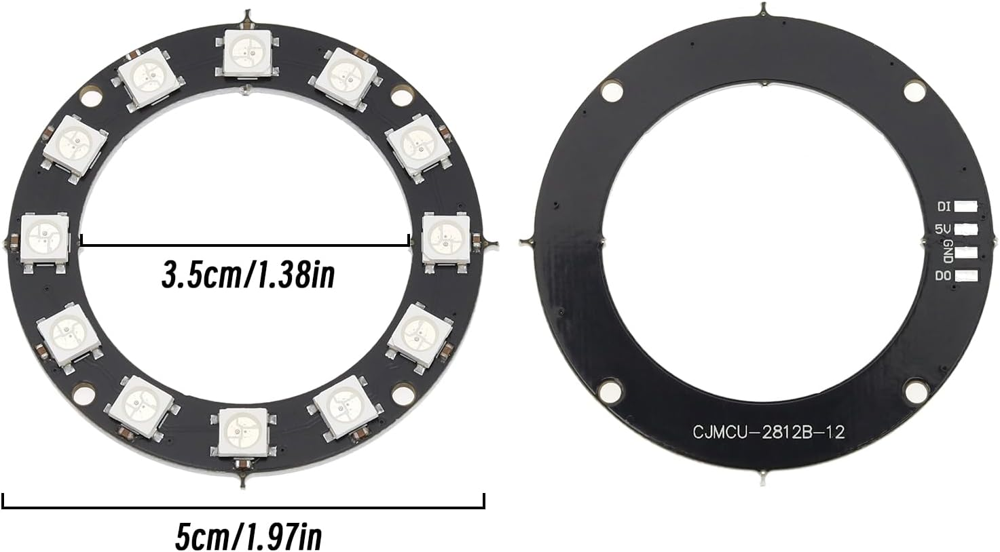

# [NeoPixelClock](https://github.com/ilneill/NeoPixelClock)

An abstract clock using a couple of 12 pixel NeoPixel rings and an Arduino Pro Mini.

## Why... Why Indeed?

I have been playing with some NeoPixel rings for a while, drawing patterns, mixing colours etc. Then I realised that, with 12 pixels in the rings, I could make a clock... sort of. Anyway, that was the idea!

## What Does It Do?

It tells you the time in an abstract way, using the LEDs on 2x NeoPixel rings, their position and their colours to represent the hours (AM/PM), minutes and seconds.

* LHS Pixel Ring: Hours, red(AM)/green(PM). Blue, seconds.
* RHS Pixel Ring: Minutes, red.             Blue, tenths.

However, I also have added a TM1637 7-segment LED display module and display the time on it too.

## The Arduino Sketch

So far, what I have written has been tested using an Arduino Pro Mini (ATmega168P) development board with an FT232 USB Serial adapter, and compiled using Arduino IDE v2.3.4.

## The NeoPixel Rings

I bought a bunch of these rings to play with and I soldered some header pins to the pads on the backside to allow me to easily connect them to a breadboard.

## ToDo

There are a few things I want to do...

* Test the NeoPixel clock on an Arduino Mega.
* Add a DS1307 RTC to retain the time while off.
* Use an AT24C32 EEPROM to track DS1307 accuracy/drift?
* Add a DS18B20 Temperature Sensor too... with an LEDC68 7-segment LED display module.

Also, do let me know if you find a problem or think of any other improvements!

## References 

My libraries for the TM16XX 7-segment LED display modules:
 * https://github.com/ilneill/easiTM1637
 * https://github.com/ilneill/easiTM1651

And the **GOTO** Guide for Markdown Syntax:
* https://www.markdownguide.org/cheat-sheet/

*Enjoy!*

// EOF